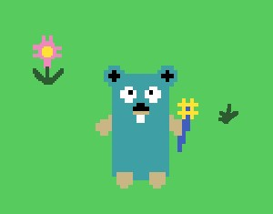

# Gopher (go for) Tough Passwords

<p style="inline-block">
Simple game to test and understand strong passwords
</p>

## Table of Contents
* [Background](#background)
* [Technologies](#technologies)
* [Setup](#setup)
* [Future Work](#future)

## Background
This game was created as a final assignment for COSC 4010: Black Hat Go (Spring 2022).

## Technologies
Project is created with:
- Go version: 1.17
- ebiten version: v2.2.7
- InputBox version: v0.0.0

## Setup
To run this project, build and run with the following commands:
```
$ go build main.go
$ ./main
```

## Future Work
- Alter drawing coordiantes to keep gopher visible
- Add end game condition
- Create shareable executable
- Add adversary
- Improve collision code

